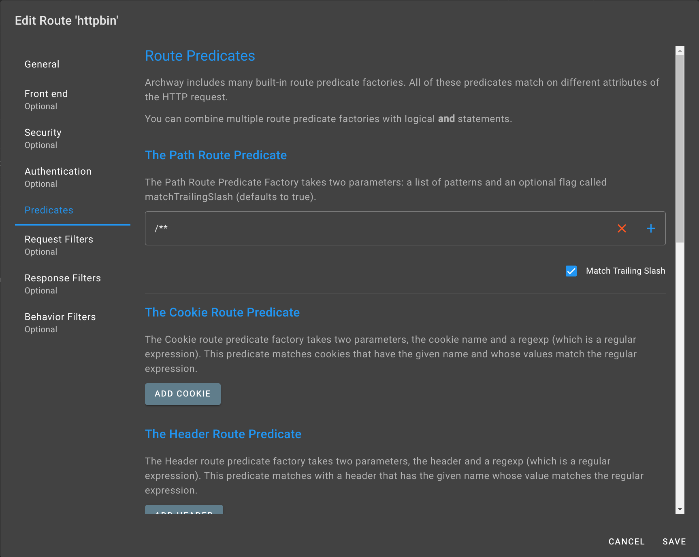

:::tip
The order of route execution is important. The first route whose predicate matches the request will be executed.
:::

We now need to define the condition for the route's execution.

Let's go to the Predicates section.

:::info
`ARCHWAY` offers a collection of predicates, mostly derived from the framework it is based on, `Spring cloud gateway`.
:::

## The Path Route Predicate

Here we will use the `Path` predicate. This means that if the path matches the predicate, the route will be executed.

Add a `Path` type predicate.

Enter:

 - Path: `/**`

This means that any routes starting with `/**` will execute this route.

This makes sense when the route is the default application managed by `ARCHWAY`.
Normally, each route should be discriminated by different paths, such as `/service1`, `/service2`, etc...

:::note
If we had used a subpath, it would probably be appropriate to add a `StripPrefix` request filter to remove the route prefix.
:::

:::tip
You can sort the routes by dragging and dropping.
:::

:::warning
The `/**` route should always be in the last position.
Make sure that the `/**` route is last on the list.
:::

:::warning
Of course, each microservice should have a different predicate.
:::

